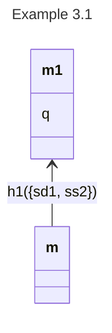
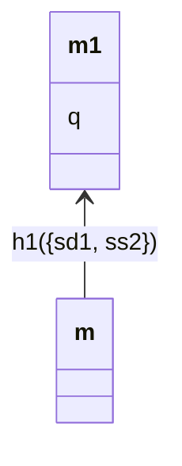

# `alo_docs` Reference

`alo_docs` is a Markdown preprocessor for writing ALOn model documents.  It
lets you keep shared metadata (aliases, actions, opposings) in one place,
expand shortcodes like `{{alias_table}}` in prose, and render the document to
clean Markdown, self-contained HTML, or portable `.mmd` files.

---

## Quick example

Below is a complete document based on Example 3.1 from *Where Responsibility
Takes You*.  It demonstrates every major feature.

````markdown
```alon-context
aliases:
  1: Alice
  2: Beth
  sd: shoots Dan
  ss: stands still
  ha: hits Alice
  q: Dan dies
actions:
  1: [sd, ss]
  2: [ss, ha]
opposings:
  sd1: [ha2]
```

# Example 3.1 

Alice can shoot Dan (`sd`) (resulting in his death, `q`) or stand still
(`ss`); Beth can stand still or hit Alice (`ha`), which would deflect Alice's
shot Thus  `ha2` opposes `sd1`.



{{model_overview}}

## Aliases

{{alias_table}}

## Actions and opposings

{{action_table}}

{{opposing_table}}

## Analysis

{{results}}
````

Running `python -m alo_docs build example.md --run-analysis` renders the
shortcodes and produces clean Markdown.  The `alon-context` block is
suppressed; its metadata is merged into the model.

---

## Document format

### `alon-context` blocks

A fenced block with language tag `alon-context` holds shared YAML metadata.
Its scope runs from its position to the next `alon-context` block (or end of
document).  Every `ModelBlock` that follows inherits these fields.

```markdown
```alon-context
aliases:
  1: Alice
  2: Beth
actions:
  1: [sd, ss]
  2: [ss, ha]
opposings:
  sd1: [ha2]
```
```

A document may contain any number of context blocks.  Each one replaces the
running context entirely (it does not accumulate).

### Model blocks (mermaid with front matter)

A `mermaid` fenced block becomes a **model block** when it starts with a YAML
front matter section delimited by `---`.

```markdown
```mermaid
---
title: My Model
type: DBT
aliases:
  q: Dan dies
actions:
  1: [sd, ss]
---
classDiagram
  ...
```
```

**Front matter fields**

| Field | Type | Notes |
|---|---|---|
| `title` | string | Human-readable name; used by shortcodes and extraction |
| `description` | string | Free text description |
| `type` | string | Model type, e.g. `DBT` |
| `aliases` | mapping | Short → long label for agents, actions, propositions |
| `actions` | mapping | Agent id → list of action ids |
| `opposings` | mapping | Action id → list of action ids that oppose it |

**Analysis fields — TD=1 models** (single evaluation point)

| Field | Default | Notes |
|---|---|---|
| `result` | `q` | Outcome proposition to evaluate responsibility for |
| `evaluation_point` | `m/h1` | Moment/history at which responsibility is assessed |

**Analysis fields — TD>1 models** (multiple evaluation points)

The `evaluate` field replaces `result`/`evaluation_point` for layered models.
It is a list of `[moment, target]` pairs, each specifying one evaluation point
and its target formula.  Defaults to `[[m/h1, q]]` when absent.

```yaml
res_analyse:
  - [m/h1, Xdo(sd1)]
  - [m/h1, do(sd1)]
  - [mm/h1, q]
  - [mm1/h1, q]
```

The `evaluate` list is preserved verbatim in extracted model files.  There is
no shortcode for it — it is consumed by the analysis engine.

Fields in the model block's own front matter take priority over inherited
`alon-context` fields at every nesting level (deep merge, model wins).

A `mermaid` block *with* front matter renders as a clean diagram with the
metadata stripped — readers see only the diagram.  A `mermaid` block *without*
front matter is not an ALOn model and is passed through unchanged.

---

## Shortcodes

Shortcodes appear in prose text as `{{name}}` or `{{name key="val" ...}}`.
They expand to Markdown tables or text at build time.

### Scope

By default a shortcode resolves against the **nearest preceding model** in the
document.  This can be changed with the `scope` argument or by naming a model
explicitly.

| Argument | Behaviour |
|---|---|
| *(none)* | Nearest preceding model |
| `scope="section"` | All models under the same heading |
| `scope="doc"` | All models in the document |
| `model="Title"` | The model whose `title` matches exactly |

### `{{alias_table}}`

Renders a two-column table of short label → long label.

```
{{alias_table}}
{{alias_table scope="doc"}}
{{alias_table model="Example 3.1"}}
```

When `scope="section"` or `scope="doc"`, aliases from all models in scope are
merged (last definition wins per key).

### `{{action_table}}`

Renders a table of agent → actions for the target model.

```
{{action_table}}
```

### `{{opposing_table}}`

Renders a table of action → opposing actions.

```
{{opposing_table}}
```

### `{{model_overview}}`

Renders a brief summary line: title, description, type, and agents.

```
{{model_overview}}
```

> **Note**: shortcodes resolve against the *nearest preceding* model, so place
> them **after** the diagram they describe.

### `{{page_break}}`

Inserts a page break.  Renders as an HTML `page-break-after` div, which is
respected by browser print / PDF export and pandoc.

```
{{page_break}}
```

### `{{results}}`

Renders the responsibility results table for the nearest model.  Requires
`build --run-analysis`.  Without it, expands to an italicised placeholder.

```
{{results}}                                    — all evaluation points
{{results eval="mm/h1" target="q"}}            — one specific pair
{{results eval="m/h1"}}                        — all targets at that moment
{{results model="Example 3.1" eval="m/h1"}}    — named model, filtered
```

The table shows **pres / sres / res / but / ness** per agent for each
evaluation point.  Multiple `{{results}}` shortcodes with different
`eval`/`target` filters let you interleave analysis with discussion:

```markdown
At moment `m/h1`, Isabella bears prescriptive responsibility for `Xdo(sd1)`:

{{results eval="m/h1" target="Xdo(sd1)"}}

Once compulsion takes hold at `mm/h1`, it is Alice who bears direct
responsibility for the outcome:

{{results eval="mm/h1" target="q"}}
```

---

## CLI

```
python -m alo_docs <subcommand> [options]
```

### `build`

Parse, resolve, and render a document.

```
python -m alo_docs build paper.md                         # markdown to stdout
python -m alo_docs build paper.md --run-analysis          # with results tables
python -m alo_docs build paper.md -f html -o out.html --run-analysis
python -m alo_docs build paper.md --show-context          # include context as comments
```

| Flag | Default | Description |
|---|---|---|
| `-f`, `--format` | `markdown` | Output format: `markdown` or `html` |
| `-o`, `--output` | stdout | Write to file instead of stdout |
| `--run-analysis` | off | Run responsibility analysis; expands `{{results}}` shortcodes |
| `--show-context` | off | Emit `alon-context` blocks as HTML comments |

The HTML output is a self-rendering
[markdeep](https://casual-effects.com/markdeep/) document with embedded
mermaid.js diagrams and a **Copy .mmd** button per model.

### `extract`

Extract each model as a self-contained `.mmd` file (resolved front matter
inlined, context removed).

```
python -m alo_docs extract paper.md                  # all models to stdout
python -m alo_docs extract paper.md -o models/       # one file per model title
```

| Flag | Default | Description |
|---|---|---|
| `-o`, `--output` | stdout | Directory to write one file per model |

Extracted files include the fully resolved front matter (inherited context
merged in), so they are portable and can be pasted directly into any Markdown
document or loaded into the Streamlit modeller.

---

## Worked output — Example 3.1

Given the document in the quick example above, `python -m alo_docs build
example.md --run-analysis` produces:

```markdown
# Example 3.1

Alice can shoot Dan (`sd`) (resulting in his death, `q`) or stand still
(`ss`); Beth can stand still or hit Alice (`ha`), which would deflect Alice's
shot Thus  `ha2` opposes `sd1`.



**Title**: Example 3.1
**Description**: Minimal single-history model; remaining histories are implicit.
**Type**: DBT
**Agents**: Alice (`1`), Beth (`2`)

## Aliases

| Short | Meaning |
|-------|---------|
| `ha` | hits Alice |
| `q` | Dan dies |
| `sd` | shoots Dan |
| `ss` | stands still |
| `1` | Alice |
| `2` | Beth |

## Actions and opposings

| Agent | Actions |
|-------|---------|
| Alice (`1`) | `sd` (shoots Dan), `ss` (stands still) |
| Beth (`2`) | `ss` (stands still), `ha` (hits Alice) |

| Action | Opposed by |
|--------|------------|
| `sd1` | `ha2` |

## Analysis

**`m/h1`** → `q` (Dan dies)

| Agent | pres | sres | res | but | ness |
|-------|------|------|-----|-----|------|
| Alice | ✓ | ✓ | ✓ | ✓ | ✓ |
| Beth  |   |   |   | ✓ | ✓ |
```

(The front matter is stripped from the diagram output; metadata is only
used for shortcode expansion and extraction.)

`python -m alo_docs extract example.md` produces a single self-contained
block with all context merged into the front matter, ready to paste or load
into the modeller.
