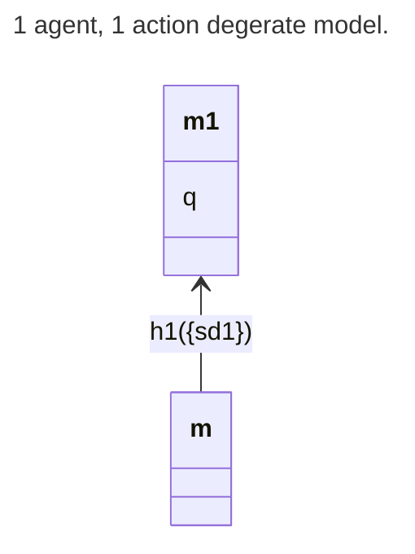
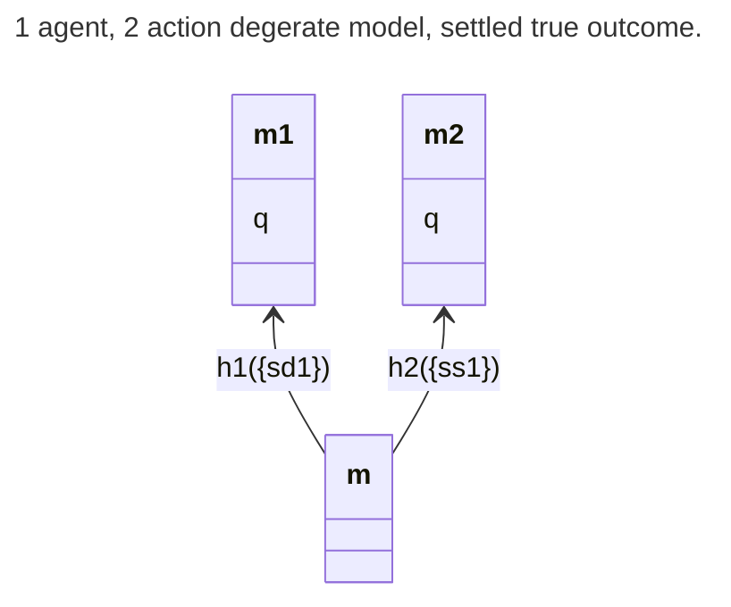
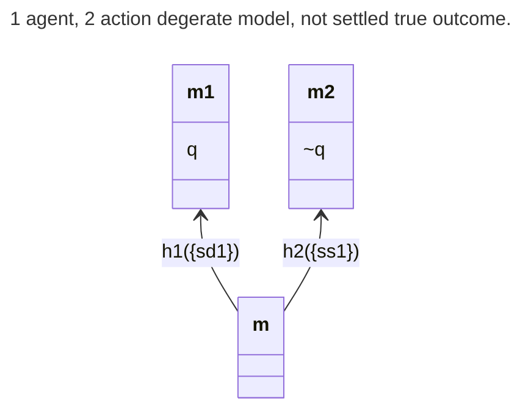
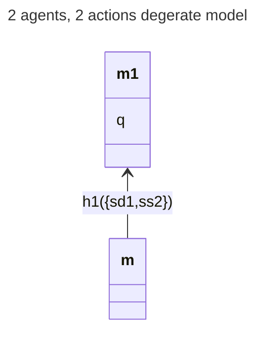

# Exploring corner cases
```alon-context
aliases:
  1: Alice
  2: Beth
  3: Isabella
  sd: shoots Dan
  ss: stands still
  sh: stay home
  ha: hits Alice
  masd: manipulates Alice into shooting Dan
  q: Dan dies
math_preamble: |
  % --- ALOn system names ---
  \newcommand{\alon}{\mathcal{ALO}_n}
  \newcommand{\alonm}{\mathcal{M}}
  % --- Model components ---
  \newcommand{\dbt}{\mathcal{T}}
  \newcommand{\hists}{\mathcal{H}^T}
  \newcommand{\mhists}[1]{\mathcal{H}^T_\mathrm{#1}}
  \newcommand{\moments}{M}
  \newcommand{\actions}{\mathcal{A}}
  \newcommand{\prop}{\mathcal{P}}
  % --- Indices and projections ---
  \newcommand{\idx}[2]{#1/#2}
  \newcommand{\mh}{m/h}
  \newcommand{\proj}[2]{#1|_{#2}}
  \newcommand{\wildcard}{{\star}}
  % --- Action and agent functions ---
  \newcommand{\act}[1]{\mathsf{act}(#1)}
  \newcommand{\agents}[1]{\mathsf{agents}(#1)}
  \newcommand{\sucs}[1]{\mathsf{succ}(#1)}
  \newcommand{\opp}[1]{\mathsf{opp}(#1)}
  \newcommand{\unopp}[2]{\mathsf{UnOpp}(#1,#2)}
  % --- Do operators ---
  \newcommand{\mydo}[2]{\mathsf{do}(#1,#2)}
  \newcommand{\mydos}[1]{\mathsf{do}(#1)}
  \newcommand{\myDo}[1]{\mathsf{Do}(#1)}
  % --- Temporal operator ---
  \newcommand{\X}{\mathbf{X}}
  % --- Results-in relation ---
  \newcommand{\resultsin}{\mathrel{\raisebox{-0.23ex}{\boxplus}\!\!\!\!\rightarrow}}
  % --- Causal notions ---
  \newcommand{\bfCause}[2]{\mathsf{bfC}(#1,#2)}
  \newcommand{\nessCause}[2]{\mathsf{nsC}(#1,#2)}
```
{{page_break}}
# Aliases
These aliases are used throughout.

{{alias_table}}

{{page_break}}

# Minimal cases
Let's consider a super minimal case: 1 agent and 1 action.




In the "standard" model structure we use, the fact that there is only one complete group action (CGA) means we have only 1 history (ALOn supports models where the same CGA has multiple outcomes, but that doesn't preclude *this* model). Thus, there are no alternatives and `Xq` is settled true (i.e., `[]Xq` is true at `m/h1`). This precludes strong or plain responsibility as they require `~[]Xq`. Given that `sd1` is the only action that happens, it seems it must be part of an actual cause. Indeed, it seems natural to argue that `but(sd1, q)` is true at `m/h1` because if `sd1` doesn't happen *nothing* happens.

One might say that it is vacuously true. One could argue that since there are no alternatives that everything is determined and nothing is "caused by a choice", though then it's questionable why the non-necessitated test is in `res` and `sres` instead of `but` and `ness`. Indeed, this suggests that actual causation can and should happen in determined settings.

Either way, it seems that if `but(sd1, q)` is true here, then `ness(sd1, q)` should likewise be true. After all, `{sd1}` is sufficient and it couldn't be more minimal. Or could it? Let's look at what the reasoner has to say:

{{results ness_empty_sufficient="true"}} 

Surprisingly, `but(sd1, q)` is true but `ness(sd1, q)` is false. 

If we look at the definition of `but`:

$$  \bfCause{\vec a}{\phi} := \X\phi \wedge \bigvee_{\begin{array}{c}\scriptstyle{
        \vec b\in \vec A}\\[-0.8ex] \scriptstyle{\vec a\sqsubseteq\vec b}
    \end{array}}
  \left (\mydos{\vec b} \wedge \bigwedge_{\vec c\in\vec A } \proj{\vec c}{I}\neq \proj{\vec a}{I}\rightarrow [\proj{\vec b}{\bar I}\oplus \proj{\vec c}{I}]\neg\phi  \right )$$

We have only one complete group action so $\vec b = \vec a$ and this is $\{sd1\}$. Thus we have only one disjunction and the inner conjunction is empty (as there are no $\vec c{I}$) and the empty conjunction is true. Thus `but(sd1, q)` is true at this point. If we compare with the `ness` definition:

 $$  \nessCause{\vec a}{\phi} := \bigvee_{\begin{array}{l}\scriptstyle{
        \vec b\in \vec A^\wildcard}\\[-0.8ex] \scriptstyle{\vec a\sqsubseteq\vec b}
    \end{array}}
  \left (\mydos{\vec b} \wedge [\vec b]\phi \wedge \bigwedge_{K\subsetneq \agents{\vec b} } \neg [\proj{\vec b}{K}]\phi  \right ).$$
  
Notably the minimality tests *all* "subsets" of the sufficient set and that includes the empty set/action. Thus we see the source of the different in actual causation assessment: with only one outcome state, and `q` being true there (and thus `[]q` true in `m/h1`), everything rests on whether there's an appropriate comparator action. For `but`, the fact that there *is no other CGA* makes every sub-action essential to the outcome including the one we consider. For `ness`, if we consider any sufficient group action, *every* subset will be sufficient *including* the empty "action". If the empty action is sufficient, then it is necessarily the only minimal sufficient set. As it has no action in it, no action can be an element of a minimal sufficient set. If we requrie K to be non-empty, we get congruent results:

{{results ness_empty_sufficient="false"}} 

Note in both cases, the settledness of  `q` only plays an indirect role. One could make non-settledness a condition of genuine actual causation. Similarly, one could make genuine choice (i.e., with an alternative) a condition (which would be similar to deliberative STIT). 

If an agent has multiple actions things are slightly different.



Compare with empty set actions:
{{results}}

And without:
{{results ness_empty_sufficient="false"}} 

Here, correctly, `sd1` is not a `but` cause, because we can replace it with `ss1` and Dan still dies. It does seem to be a necessary element of a sufficient set. `{sd1}` is sufficient. Removing it gets you an insufficient empty set. Conversely

If we modify the model so in `h2` he doesn't die:



With empty set actions:
{{results}}

Without:
{{results ness_empty_sufficient="false"}} 


We're back to a relatively normal sceanrio. Since `[]Xq` no longer holds, the empty action isn't a sufficient cause, so `{sd1}` *is*. Thus we get `but` and `ness` and, indeed, all the responsibilities.

{{page_break}}
We can add another agent and action:


Without blocking empty sets, we get a ton of `but`s but no `ness`:
{{results}}

If we block empty actions:

{{results ness_empty_sufficient="false"}} 

Note the group action, `{sd1, ss2}` is *not* a NESS cause. Each singleton action is also sufficient thus any superset of either cannot be minimal. While this model looks counter intuitive (how can Beth's standing still kill Dan?), it is not hard to come up with a reasonable scenario, e.g., Dan had a heart attack thus either shooting him or standing around would result in his death.

What is broken now is the `but` analysis. Even in our strained scenario, we have a classic case of causal overdetermination, thus while both "should be" NESS, neither should be `but`. 