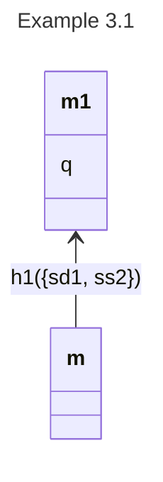

```alon-context
aliases:
  1: Alice
  2: Beth
  sd: shoots Dan
  ss: stands still
  ha: hits Alice
  q: Dan dies
actions:
  1: [sd, ss]
  2: [ss, ha]
opposings:
  sd1: [ha2]
```
# Example 3.1 

Alice can shoot Dan (`sd`) (resulting in his death, `q`) or stand still
(`ss`); Beth can stand still or hit Alice (`ha`), which would deflect Alice's
shot Thus  `ha2` opposes `sd1`.



{{model_overview}}

## Aliases

{{alias_table}}

## Actions and opposings

{{action_table}}

{{opposing_table}}

## Analysis

{{results}}