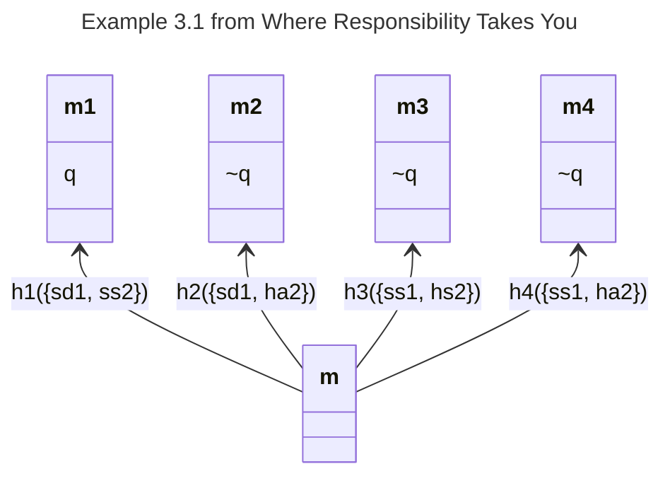
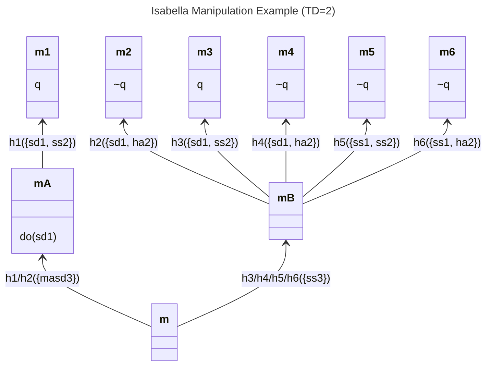
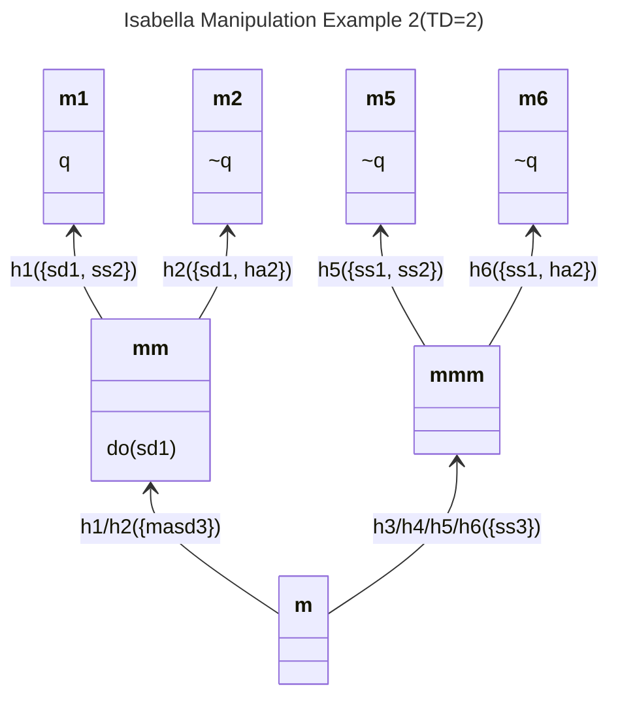
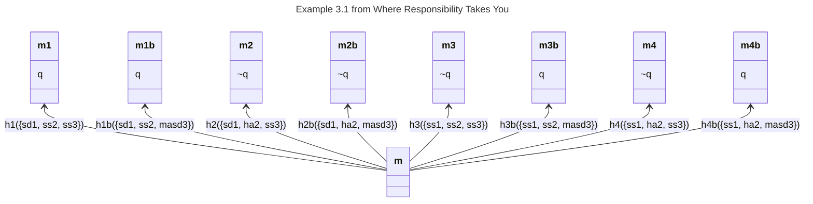

# Manipulation Cases in ALOn with varying temporal modal depths

ALOn allows, within a moment, for agents to interfere with each other. Following the general approach of STIT logics where *within* a moment agents cannot *preclude* other agent's choices, this interference cannot *preclude* another agent from essaying an action
. Thus, if Alice has a choice at a moment to shoot Dan or stand still, it must be possible for her to do either no matter what any other agent might do at a moment. Thus, if Beth has the choice whether to stand still or hit Alice's arm (to mess up her shot) then all four combinations of Alice's and Beth's actions must be possible at that moment. Unlike in standard STIT logics, since the agents are choosing between actions and not (sets of) histories, there is conceptual leeway for actions to interfere with *how they play out*. Thus, if Alice shoots (at) Dan but Beth jostles her arm throwing off her aim, Dan will live. Dan will also live if Alice decides to stand still.

This is a significant departure from standard STIT. In STIT logics, choices (or "choice cells") are sets of histories. Compatibility of choices cashes out as every intersection of choice cells must be non-empty. Since a STIT claim such as `[alice stit]danisdead` (Alice sees to it that Dan is dead) individuate history sets by *their common ensured proposition*. Thus, `[alice stit]danisdead` and `[beth stit]~danisdead` are inconsistent choices, because no matter how we allocate histories to the corresponding choice cells, their intersection must be empty.
^["Accordingly, a formula like do(ai ) means that agent i is carrying out an action of type a, without this implying anything about his success or failure in doing so. The important point is that it makes perfect sense to say that an agent is doing something even if, in the end, she fails because of some external opposition." quote from Ilaria]

[discuss the semantic difference between direct stit and the alon defined stit]


```alon-context
aliases:
  1: Alice
  2: Beth
  3: Isabella
  sd: shoots Dan
  ss: stands still
  ha: hits Alice
  masd: manipulates Alice into shooting Dan
  q: Dan dies
```

# Aliases
These aliases are used throughout.

{{alias_table}}

{{page_break}}

# Example 3.1 from Where Responsibility Takes You

We can formalise our initial example in ALOn (following the presentation in Where Responsibility Takes You.) (See the Alias table above to map the logical symbols into their intended readings.)




{{action_table}}

{{opposing_table}}

{{page_break}}

# Isabella Manipulation Example (TD=2)

Here's an attempt to model a multistep manipulation case. Critically, the manipualation is fully determinative, i.e., it's a compulsion. After the manipulation, Alice has no choice but to shoot Dan.  However, *without** manipulation Alice is still free to choose whether to shoot Dan. In the Isabella not manipulating case, possible histories play out as in Example 3.1.



{{model_overview}}

## Actions and opposings

{{action_table}}

{{opposing_table}}

## Analysis

There are several points of potential interest. First, we can check the situation where Isabella doesn't manipulate. We might expect that learning that Isabella did nothing to affect Alice or Beth should leave our earlier judgements of their causal responsibility untouched. Which it does:

{{results eval="m/h1" target="do(sd1)"}} 


we can ask if Isabella is responsible for Alice's shooting of Dan:

{{results eval="m/h1" target="do(sd1)"}} 

{{page_break}}

# Isabella Manipulation Example 2 (TD=2)

T


{{model_overview}}

## Actions and opposings

{{action_table}}

{{opposing_table}}

## Analysis

{{results}}

# Weird, TD=1 Isabella case
