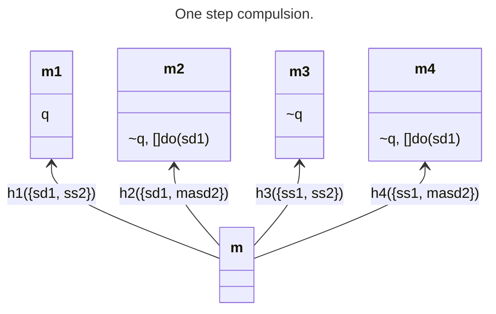
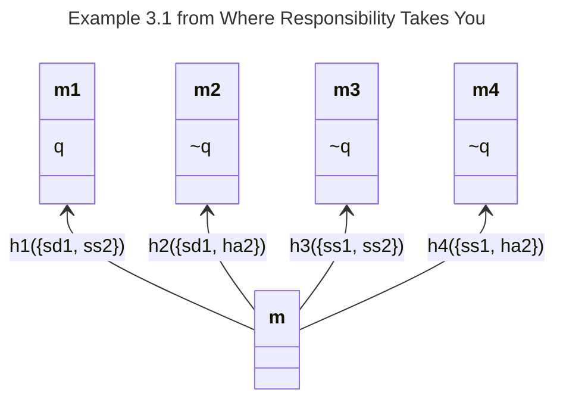
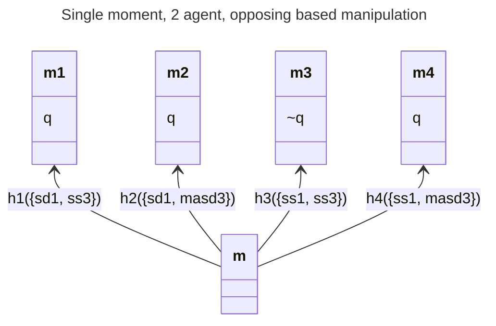
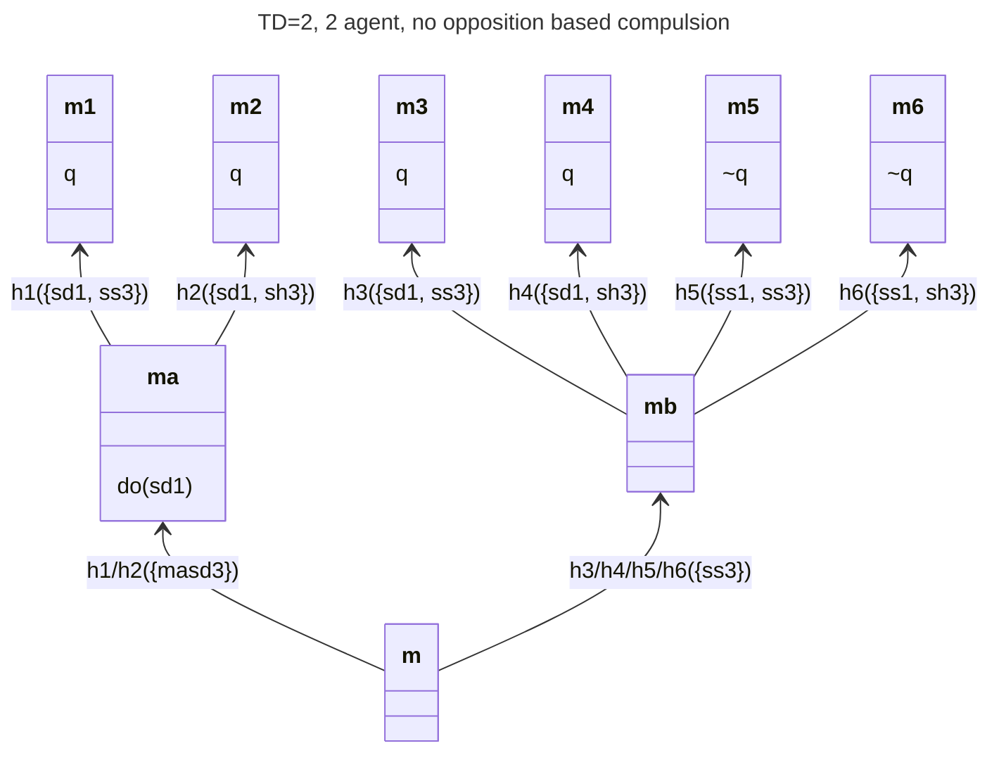

# One step compulsion


{{alias_table}}
{{page_break}}

# Manipulation Cases in ALOn with varying temporal modal depths

ALOn allows, within a moment, for agents to interfere with each other. Following the general approach of STIT logics where *within* a moment agents cannot *preclude* other agent's choices, this interference cannot *preclude* another agent from essaying an action
. Thus, if Alice has a choice at a moment to shoot Dan or stand still, it must be possible for her to do either no matter what any other agent might do at a moment. Thus, if Beth has the choice whether to stand still or hit Alice's arm (to mess up her shot) then all four combinations of Alice's and Beth's actions must be possible at that moment. Unlike in standard STIT logics, since the agents are choosing between actions and not (sets of) histories, there is conceptual leeway for actions to interfere with *how they play out*. Thus, if Alice shoots (at) Dan but Beth jostles her arm throwing off her aim, Dan will live. Dan will also live if Alice decides to stand still.

This is a significant departure from standard STIT. In STIT logics, choices (or "choice cells") are sets of histories. Compatibility of choices cashes out as every intersection of choice cells must be non-empty. Since a STIT claim such as `[alice stit]danisdead` (Alice sees to it that Dan is dead) individuate history sets by *their common ensured proposition*. Thus, `[alice stit]danisdead` and `[beth stit]~danisdead` are inconsistent choices, because no matter how we allocate histories to the corresponding choice cells, their intersection must be empty.
^["Accordingly, a formula like do(ai ) means that agent i is carrying out an action of type a, without this implying anything about his success or failure in doing so. The important point is that it makes perfect sense to say that an agent is doing something even if, in the end, she fails because of some external opposition." quote from Ilaria]

[discuss the semantic difference between direct stit and the alon defined stit]

[discuss manipulation cases in general]

```alon-context
aliases:
  1: Alice
  2: Beth
  3: Isabella
  sd: shoots Dan
  ss: stands still
  sh: stay home
  ha: hits Alice
  masd: manipulates Alice into shooting Dan
  q: Dan dies
```
{{page_break}}
# Aliases
These aliases are used throughout.

{{alias_table}}

{{page_break}}

# Basic scenario

Throughout, the possible manipulated action will be Alice shooting Dan (`sd1`). The potential manipulator will be Isabella with her core manipluation action being maniplating Alice into shooting Dan (`masd3`).


# Example 3.1 from Where Responsibility Takes You

We can formalise our initial, non-manipulation example in ALOn (following the presentation in Where Responsibility Takes You.) (See the Alias table above to map the logical symbols into their intended readings.)


The action structure is straightforward: Each agent has two actions, thus we have 4 possible "complete group actions" and  thus 4 possible histories.

{{action_table}}

Beth hitting Alice (`ha2`) opposes Alice's shooting of Dan (`sd1`). 

{{opposing_table}}

We get the same results given in Chapter 3, but since we always analyse all possible actors, thus all groups, we also get the group results:

{{results}} 

Strikingly, the Alice + Beth group's responsibility for Dan's death is stronger than that of Alice alone ({Alice, Beth} is also `dxstit`'s `q`). This reflects that Beth, even though she does not do anything positive to enact Dan's death, could have prevented it. (This does also show up in the fact that she is a but-for and NESS cause of his death.)

In the DBT structure we see that Alice successfully shoots Dan if she shoots unopposed (see `m1`). We also note that Beth successfully opposes Alice with `ha2` (see `m2`). The connection between `sd1` and killing Dan (`q`) is *implicit* in the model structure. We don't have any asserted formualae that would induce this model. 

For example, one might expect that something like `do(sd1) -> Xq` might express that "an effect of `sd1` is `q`". But if the conditional is a standard material conditional, then doing `sd1` can never fail to achieve `q`. Indeed, we can see in this model that `do(sd1) -> Xq` is false at m (though true at `m/h1`, as `q` is true at `m1/h1`, thus `Xq` is true at `m/h1`...this is unhelpful as the conditional will be true for every action done at `m/h1` thus does not capture action specific effects). This model validates at `m/h1` that `do(sd1) [+]-> q` (indeed, this is true at all `m` indicies).


The model supports that Beth's opposition (via `ha`) is *successful*, in that when Beth opposed `sd1`, `~q` followed. If Beth's opposition were ineffectual, i.e., her hitting Alice's arms didn't prevent Dan's death (i.e., she missed or Alice corrected), then she would not be causally involved at all. The group would still `dxstit` `q` because, in this model, each complete group action has only one history.


{{page_break}}

# A Oppositional Approach to Manipulation

Given that moments are temporally extended and that, canonically, actions can interfere with other actions, it is natural to explore modelling manipulation in this setting. 

We can swap out Beth for Isabella in our prior model and allow Isabella to "manipulate Alice into shooting Dan" (`msad3`). In order for it to make sense, we have to adjust the outcomes appropriately. Since nothing opposes Alice shooting Dan, she successfully kills Dan whenever she shoots him. The question remainds what happens when Isabella manipulates here:

1. If Alice is already shooting Dan, Dan dies.
2. If Alice tries to stand still (i.e., not shoot Dan), she fails, and Dan dies.

Thus, the only history where Dan survives is when they both stand still.



At `m/h1`, we get what one would expect: Alice has all the causal responsibility. Isabella's standing still has no role. Her only available other action would not *prevent* Dan's death, so hers is not a sin of omission.


{{results eval="m/h1" target="q"}} 

While not explicitly captured in the model, it's not necessarily odd that Isabella doesn't have the hit Alice's option that Beth: Isabella could be too far away and only manipulating Alice via a radio link to an embedded chip.

In `m/h2`, we have a classic overdetermination a la multiple simultaneous shooters of Dan.

{{results eval="m/h2" target="q"}} 

Because Alice shooting Dan and manipulating Alice into shooting Dan both are *sufficient* for his death, they are NESS causes but not but for causes. Both Alice and Isabella are in symmetric situations, responsibilitywise.

In the last death scenario (`m/h4`), we have the mirror image of `m/h1`. In this case, it is Isabella's manipulation that does the work of killing Dan so she bears all the responsibility.

{{results eval="m/h4" target="q"}} 

The absence of a shooting Dan *action* in this model is a bit peculiar. It is not terribly difficult to imagine a scenario that fits:

> Alice had bought the gun to shoot Dan and brought it to the park where he was loitering with the express purpose of shooting him. But when she saw him and felt the weight of the gun in her hand she started. "What am I doing!? His dumping leaves in my yard doesn't merit *death*!" But then, to her horror, she found her arm raising up and pointing the gun against her will! She screamed in bewilderment inside her head as her finger slowly squeeze the trigger. "What is happening?!?" she thought as her eyes frantically scanned the scene until she saw Isabella looking at her with a remote control in her hand. Alice realised that Isabella was controlling her. As the sound of the bullet that took Dan's life deafened her she realized an important life lesson: Don't accept brain surgery from people you just met at a bar.

Clearly, if we examine the causal microstructure of this scenario, we find that Alice shot Dan and her shooting action is physically very similar to if she had freely shot him. Our current model does not capture this similarity between the two situation. It is not granular enough to distinguish between the Isabella manipulating Alice scenario and the Isabella shooting Dan scenario. The only model visible difference is the names of Isabella's death-dealing action.^[One way to de-primitivize the opposing relation is to make it emergent on a causal substructure where the opposing action precludes the opposed action (or some subpart of it). That is, an action like shooting Dan rests on a series of actions, e.g., drawing the gun, aiming, pulling the trigger. Hitting Alice's arm presumably comes in to preclude `aiming at Dan's heart` and induce something like `aiming above his sholder`. Aiming above his sholder does not have the result, expected or otherwise, of killing him. Thus the opposition was successful.]

This is workable, but rather unsatisfactory. Manipulation, coercion, and compulsion have as their natural outcomes *actions* performed by the manipulated, coerced, or compelled agent. This cannot be represented in ALOn with models with a temporal depth of one. Actions can interfere with other actions *only* in distorting the outcome. Indeed, the principle of independence of agents inherited from STIT logic precludes aught else. Without action interaction, DBT models do not seem to have real temporal progress. It is very natural that my range of available actions should vary from moment to moment. For example, once Alice has killed Dan, she no longer *can* kill him. One might try to finesse this by saying she can always still shoot poor Dan's body, but we would then be in the weird situation that after shoot (and killing) Dan, she shot his dead body...and killed Dan? In any case, *Dan* certainly can do anything after he's dead. Actions need to be able to affect the *availability* of actions (in successor moments), not just the *success* of actions.

{{page_break}}

# Minimal TD=2 Case
In what follows, we relax the ALOn constraint that *all* actions available to an agent *anywhere* are available *everywhere*: Availability of actions can vary from moment to moment.



{{results}}
<hr>

{{results eval="m/h1" target="Xq"}} 