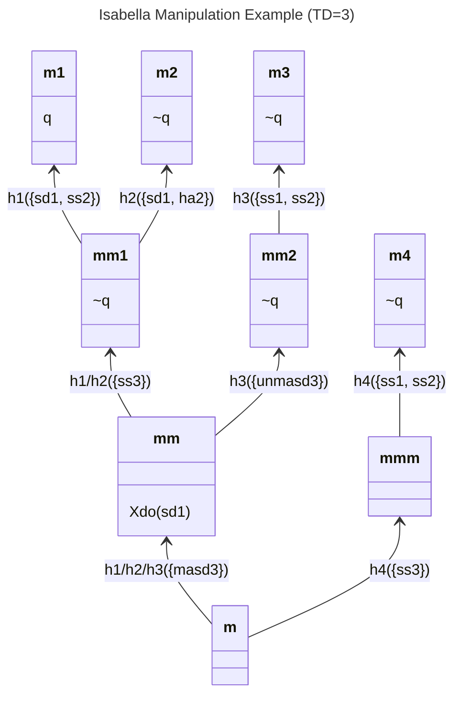

```mermaid
---
title: Isabella Manipulation Example (TD=3)
description: Isabella has the option to rescind her compulsion
type: DBT
actions:
  1:
    - sd
    - ss
  2:
    - ss
    - ha
  3:
    - ss
    - masd
    - unmasd
opposings:
  sd1:
    - ha2
aliases:
  1: Alice
  2: Beth
  3: Isabella
  sd: shoots Dan
  ss: stands still
  ha: hits Alice
  masd: manipulates Alice into shooting Dan
  unmasd: unmanipulates Alice into shooting Dan
  q: Dan dies
result: q
evaluation_point: m/h1
res_analyse:
  - - m/h1
    - Xdo(sd1)
  - - m/h1
    - do(sd1)
  - - m/h1
    - q
  - - m/h1
    - Xq
  - - m/h1
    - XXq
---
classDiagram
direction BT


  m --> mm : h1/h2/h3({masd3})
  m --> mmm : h4({ss3})

  mm --> mm1 : h1/h2({ss3})
  mm --> mm2 : h3({unmasd3})
  mm1 --> m1 : h1({sd1, ss2})
  mm1 --> m2 : h2({sd1, ha2})
  mm2 --> m3 : h3({ss1, ss2})
  mmm --> m4 : h4({ss1, ss2}) 

  mm: Xdo(sd1)
  m1: q
  m2: ~q
  m3: ~q
  m4: ~q
  mm1: ~q
  mm2: ~q
```
{{results}}